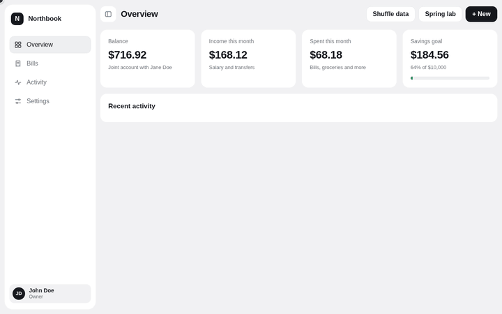

<h1>
  <picture>
    <source media="(prefers-color-scheme: dark)" srcset="assets/brand/lockup-dark.svg">
    
  </picture>
</h1>

Physics-based spring animations for the web, React and React Native that keep their velocity when they are interrupted.

[](https://damped.dagadev.net)

Docs and the playground live at [damped.dagadev.net](https://damped.dagadev.net). Try it in [**Northbook**](https://damped.dagadev.net), a fictional personal-finance app built only on these packages. Open a bill, press Escape halfway and watch it turn around; change the duration and bounce of the whole app in the Spring lab.

> damped `0.1.0` is published to npm as `@damped/core`, `@damped/react` and `@damped/native`.

## Packages

| Package | What it is | Docs |
| --- | --- | --- |
| [`@damped/core`](packages/core) | Springs, a frame scheduler, `animate`, an optional compositor driver, FLIP `layout`, `morph`, and `enter` / `exit`. No dependencies, no React. | [README](packages/core/README.md) |
| [`@damped/react`](packages/react) | `useSpringValue`, `useSpring`, `useLayout`, `useMorph` and `<Presence>` for React 19. Nothing re-renders per frame. | [README](packages/react/README.md) |
| [`@damped/native`](packages/native) | `withDamped` and `toReanimated` for Reanimated 4 on Expo SDK 57. | [README](packages/native/README.md) |

## Quick start

**Core**

```ts
import { animate } from "@damped/core";

const card = document.querySelector<HTMLElement>(".card")!;
animate(card, { x: 200, opacity: 0.5 }, { duration: 0.5, bounce: 0.2 });
```

**React**

```tsx
import { useSpring } from "@damped/react";

function Card({ active }: { active: boolean }) {
  const ref = useSpring<HTMLDivElement>({ scale: active ? 1.05 : 1 }, { duration: 0.4 });
  return <div ref={ref}>Card</div>;
}
```

**React Native**

```tsx
import { useSharedValue } from "react-native-reanimated";
import { withDamped } from "@damped/native";

function useSlide() {
  const x = useSharedValue(0);
  return { x, toggle: () => (x.value = withDamped(x.value === 0 ? 200 : 0, { duration: 0.5, bounce: 0.15 })) };
}
```

## Why it is different

Each point below is covered by a test in this repository, except where it cites a source file.

- **Interruption keeps momentum.** Retargeting a running animation continues from its position and velocity. A card that opens and is closed halfway reverses smoothly, because the velocity is carried over and not reset. In the Chromium test the reversal continues moving the same way for a moment (+37.0 px, then +27.2 px) before it turns back.
- **Springs are analytic.** Position and velocity are computed at any time `t` from the closed-form solution, for under-, critically and over-damped springs. A test drives them at 60 Hz, 144 Hz and an irregular cadence and gets the same state within 1e-12.
- **Layout and morph are first-class.** `layout` animates an element from its old box to its new one (FLIP) and `morph` turns one element into another, correcting the size of children and the border radius so content is not distorted while the box scales.
- **Optional compositor driver.** Pass `compositor` to `animate` and the spring is played by the browser's compositor thread. In Chromium, it keeps moving while the main thread is blocked and the same spring on the JS driver stops.
- **Idle means idle.** The scheduler requests no animation frame when nothing is animating.
- **React without per-frame renders.** Values reach the DOM through refs. A test counts zero renders across hundreds of animation frames, and exactly one per open, close or drop.
- **Reversal on React Native.** In Reanimated 4.5.1, `withSpring` sets the velocity to 0 when a retargeted spring's velocity points away from the new target. `withDamped` keeps it. See the [comparison](packages/native/README.md#why-not-just-withspring).
- **Reduced motion from the first API.** Every function that moves an element follows one rule: spatial motion jumps, fades remain.

## Accessibility

- **Reduced motion.** By default the `reducedMotion` option follows `prefers-reduced-motion` in every core API and every React hook: `x`, `y`, `rotate` and scale jump to their target, while `opacity` and `blur` still animate. The option can force it on or off. See [Reduced motion](packages/core/README.md#reduced-motion).
- **Leaving elements.** While an element exits, it is `inert` and `aria-hidden`, so it cannot take focus or be announced.
- **Dialogs and focus.** The packages animate; they do not manage focus. The [Northbook bills view](apps/playground/src/BillCard.tsx) shows a card-to-dialog morph with focus moved into the dialog, a focus trap, Escape and the backdrop to close, focus returned to the card, and a dialog that is `inert` while it closes. The grid of cards is a single tab stop with arrow-key navigation.

## Bundle size

Measured with `bun run sizes`: each package is built as it ships, then each consumer is bundled and minified the way an application would, and gzip is zlib's default level.

| Consumer | Bundle | Gzip |
| --- | ---: | ---: |
| `animate` | 9,613 B | 4,044 B (3.95 KB) |
| `animate` + `compositor` | 11,602 B | 4,784 B (4.67 KB) |
| `layout` | 12,748 B | 5,186 B (5.06 KB) |
| `morph` | 13,356 B | 5,428 B (5.30 KB) |
| `enter` / `exit` | 11,374 B | 4,616 B (4.51 KB) |
| full `@damped/core` | 18,198 B | 7,158 B (6.99 KB) |
| `@damped/react` dist (`@damped/core` and `react` external) | 6,266 B | 2,534 B (2.47 KB) |
| `useMorph` + `Presence` (`@damped/core` bundled, `react` external) | 19,288 B | 7,600 B (7.42 KB) |
| `@damped/native` dist (not minified: the worklets plugin needs the directives) | 5,319 B | 1,609 B (1.57 KB) |

- The packages are flagged `sideEffects: false`, so you pay for what you import. `compositor` is a value you import, and an application that never passes it does not bundle it.
- The original goal for the whole core was under about 5 KB gzip. The whole library is 6.99 KB; an application that only animates pays 3.95 KB.
- The Northbook playground, including React and React DOM, is 77,634 B of JavaScript gzip.

## When to use something else

damped does a few things well and leaves the rest out. Reach for another library when you need:

- **Gestures, drag and scroll-linked animation, or a framework other than React.** damped has none of them. [Motion](https://motion.dev) covers gestures and scroll, and works with more than React.
- **Shared elements across unmounts.** `useMorph` keeps both elements mounted. Motion's `layoutId` can animate between an element that React has unmounted and one that mounts. A registry like that is not built yet.
- **Keyframes, timelines and sequencing on the web.** damped animates springs toward targets; it has no keyframe or timeline API.
- **The full React Native animation toolkit.** [Reanimated](https://docs.swmansion.com/react-native-reanimated/) has layout animations, gesture integration, transitions and more. `@damped/native` is one spring function that you use with it, not a replacement.
- **A library that has been on a device.** `@damped/native` has not been run on a physical device or simulator yet. See its [limitations](packages/native/README.md#limitations).

## Development

Bun 1.4.2 is the package manager and test runner, used for development only. Published code does not depend on Bun.

| Command | What it does |
| --- | --- |
| `bun install` | Installs the workspace. |
| `bun test` | Unit tests for every package, the scripts and the playground helpers (happy-dom). |
| `bun run e2e` | Playwright tests in Chromium: browser behavior of the core and the whole playground. |
| `bun run typecheck` | Type-checks packages, tests, the playground and the scripts. |
| `bun run build` | Builds the three packages into their `dist` folders. |
| `bun run playground:build` | Builds the Northbook playground into `apps/playground/dist`. |
| `bun run playground:serve` | Serves that build at `http://127.0.0.1:4180/`. |
| `bun run docs:check` | Type-checks every TypeScript example in the READMEs. |
| `bun run sizes` | Prints the bundle size table above. |
| `bun run demo:gif` | Records the scripted Northbook scene into `assets/northbook.gif` (needs `ffmpeg`). |

The playground is deployed to https://damped.dagadev.net by a GitHub Actions workflow on every push to `main`.

## Release

1. Bump the three `version` fields in `packages/*/package.json` together.
2. Push a `v*` tag (e.g. `v0.1.0`); `.github/workflows/release.yml` builds, tests and runs `npm publish --provenance --access public` in each package.
3. It needs the `NPM_TOKEN` secret with publish rights on the `@damped` scope.

## License

MIT. See [LICENSE](LICENSE).
